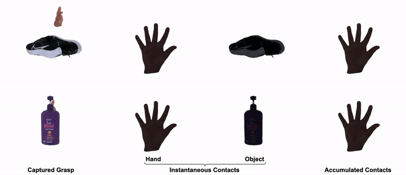

<div align="center">

# <b>MANUS</b>: Markerless Grasp Capture using Articulated 3D Gaussians

Chandradeep Pokhariya<sup>1</sup>, Ishaan N Shah <sup>1*</sup>, Angela Xing<sup>2*</sup>, Zekun Li<sup>2</sup>, Kefan Chen<sup>2</sup>, Avinash Sharma<sup>1</sup>, Srinath Sridhar <sup>2</sup>

<sup>1</sup>CVIT, IIIT Hyderabad &nbsp;&nbsp; <sup>2</sup>Brown University &nbsp;&nbsp; <sup>*</sup>Equal Contribution 

### [Project Page](https://ivl.cs.brown.edu/research/manus.html) · [Paper](https://arxiv.org/pdf/2312.02137)

</div>



<br>

## Abstract
Understanding how we grasp objects with our hands has important applications in areas like robotics and mixed reality. However, this challenging problem requires accurate modeling of the contact between hands and objects. To capture grasps, existing methods use skeletons, meshes, or parametric models that does not represent hand shape accurately resulting in inaccurate contacts. We present MANUS, a method for Markerless Hand-Object Grasp Capture using Articulated 3D Gaussians. We build a novel articulated 3D Gaussians representation that extends 3D Gaussian splatting for high-fidelity representation of articulating hands. Since our representation uses Gaussian primitives optimized from the multi view pixel-aligned losses, it enables us to efficiently and accurately estimate contacts between the hand and the object. For the most accurate results, our method requires tens of camera views that current datasets do not provide. We therefore build MANUSGrasps, a new dataset that contains hand-object grasps viewed from 50+ cameras across 30+ scenes, 3 subjects, and comprising over 7M frames. In addition to extensive qualitative results, we also show that our method outperforms others on a quantitative contact evaluation method that uses paint transfer from the object to the hand.

<br> 

## How to start
MANUS is built on top of original Gaussian Splatting codebase and reuses functions from it's codebase heavily. 
Clone the repository using `git clone --recursive <link>`. 

We can use conda to setup the python environment like this
```
bash setup_env.sh
```

Apart from the conda env, we use `Blender` to get novel views during test time. You can download the Blender(3.3) and provide the path to the bash file. 

## Codebase Info
- `config` folder contains the config files for trainer, dataset, and different modules. These config parameters can be overridden in the `bash script`. To maintain the config, we use `hyra-core`.
- `src` contains the main code, and `data` contains the essential data required. 
- `main.py` file contains driver code from which everything kickstarts. 
- `submodules` folder contains the differentiable rasterizer and knn provided by original Gaussian-Splatting repo. 

## MANUS-Grasps Dataset
Please check [Dataset.md](Dataset.md) to get dataset information. 

Download small batch of dataset from [here](https://drive.google.com/drive/folders/15ihoMdU0PFUNkJSJxBpdrMy1lNT7fASu?usp=sharing)

```
import gdown
gdown.download_folder(url = {url})
```


## Optimization

To optimize object module on our dataset. 
```
bash scripts/train/train_object.sh {SUBJECT}
```

To optimize hand module on our dataset. 
```
bash scripts/train/train_hands_ours.sh {SUBJECT} {EXP_NAME}
```

To composite the scene either for the grasp results of for the evaluation. 
```
bash scripts/composite.sh {SUBJECT} {HAND_EXP_NAME} {results/eval}
```

## Citation
```
@misc{pokhariya2023manus,
      title={MANUS: Markerless Hand-Object Grasp Capture using Articulated 3D Gaussians}, 
      author={Chandradeep Pokhariya and Ishaan N Shah and Angela Xing and Zekun Li and Kefan Chen and Avinash Sharma and Srinath Sridhar},
      year={2023},
      eprint={2312.02137},
      archivePrefix={arXiv},
      primaryClass={cs.CV}
}
```

## Acknowledgement
```
This work was supported by NSF CAREER grant #2143576, ONR DURIP grant N00014-23-1-2804, ONR grant N00014-22-1-259, a gift from Meta Reality Labs, and an AWS Cloud Credits award. We would like to thank George Konidaris, Stefanie Tellex and Dingxi Zhang. Additionally, we thank Bank of Baroda for partially funding Chandradeep’s travel expenses.
```

